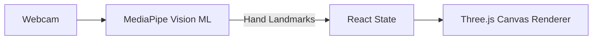

# 🚀 AirDrawer

> An innovative application that allows users to draw in mid-air using hand tracking and Three.js.

### 🌐 Live Demo
[🚀 OPEN LIVE DEMO →](https://air-drawer.vercel.app) | [💻 Source Code](https://github.com/YUVA-2329/AirDrawer) 

---

## 🎬 Demo & 📸 Screenshots


*(Project preview and screenshots demonstrating the core user experience)*

---

## 🧠 About the Project

This project was built to solve real-world challenges through modern web technologies and advanced engineering. By combining scalable architecture with an intuitive user interface, AirDrawer provides an exceptional user experience while maintaining high performance and security.

### ✨ Key Features
- 🖐️ Real-time hand tracking using MediaPipe
- 🖌️ 3D drawing capabilities using Three.js
- 🎥 Webcam integration
- 🎨 Custom canvas rendering
- ⚡ High FPS performance optimization

---

## 🛠️ Tech Stack

**Frontend:** React, Three.js, Tailwind CSS
**Machine Learning:** MediaPipe Hands

---

## 🏗️ Architecture



---

## ⚙️ How It Works

1. The application requests webcam permissions.
2. MediaPipe tracks the user's index finger in 3D space.
3. The coordinates are mapped to a Three.js scene.
4. Lines are rendered continuously as the user moves their hand.

---

## 🚀 Getting Started

### Installation

```bash
git clone https://github.com/YUVA-2329/AirDrawer.git
cd airdrawer
npm install
npm run dev
```

### Environment Variables
Create a `.env` file in the root directory:
```env
# No environment variables required
```

---

## 📁 Project Structure

```text
project/
├── src/
│   ├── components/
│   ├── utils/
│   └── App.tsx
└── package.json
```

---

## 🛣️ Roadmap

- [x] Hand tracking integration
- [x] Basic drawing logic
- [ ] Color selection palette
- [ ] Save/Export drawings

---

## 📊 Status

🟡 Prototype

---

## 👨‍💻 Author

**Yuva Kishore Peta**  
GitHub: [YUVA-2329](https://github.com/YUVA-2329)
